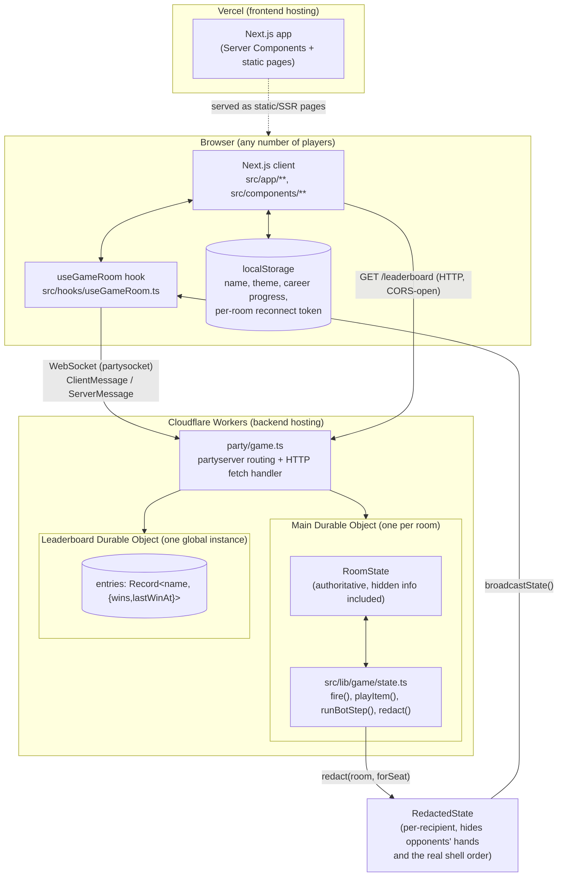

# ARCHITECTURE.md — Technical Architecture Reference

## System overview

Chamber Seven is a two-deployable-target application:

1. A **Next.js frontend** (Vercel) that renders all UI and holds no
   authoritative game state of its own.
2. A **Cloudflare Worker** (`party/game.ts`, deployed via `wrangler`)
   built on `partyserver`, which hosts one **Durable Object instance per
   game room** (`Main`) plus one global **Durable Object** for the
   leaderboard (`Leaderboard`). The Worker is the sole source of truth for
   game state; it is reached exclusively over WebSocket (plus one plain
   HTTP route for the leaderboard).

Both sides import the same rules engine from `src/lib/game/` (types,
settings-clamping, and the full state machine), so the "rules" are
defined once, but only the Worker ever *executes* them against real,
authoritative state — the client only uses this shared code for type
safety and for pre-validating settings in the UI before sending them.

## Architecture diagram

## Frontend structure

- **Routing:** Next.js App Router, all routes under `src/app/`. Five
  routes total: `/` (landing), `/room/[roomId]` (the game itself, driven
  by `?ai=1` and `?career=<botId>` query params), `/career`, `/leaderboard`,
  `/changelog`.
- **Rendering strategy:** `/`, `/career`, `/changelog`, `/leaderboard` are
  effectively static/Server-Component pages (no `force-dynamic`, no
  per-request server data fetching — `/leaderboard`'s data fetch happens
  **client-side** in a `useEffect`, not on the server, despite the route
  itself being statically generated per `next build`'s route table).
  `/room/[roomId]` is the one dynamic route (`ƒ` in the build output)
  because it reads `useParams`/`useSearchParams` and owns a live
  WebSocket connection — it is a `"use client"` component tree from
  `GameRoom` down.
- **Server/client boundaries:** Only components that need
  `localStorage`, WebSocket, or interactive state are marked
  `"use client"` (e.g. `GameRoom.tsx`, `GameSettingsForm.tsx`,
  `ThemePicker.tsx`, `Lobby.tsx`, `EventLog.tsx`, all of
  `src/hooks/`). Static/presentational pieces (`Flourish.tsx`,
  `HealthBar.tsx`, `ChamberBar.tsx`, `ActionBar.tsx`, `itemIcons.tsx`)
  have no directive and can run as Server Components when their parent
  allows it, though in practice most are rendered inside an already
  client-boundary parent (`PlayingView.tsx`).
- **State management:** No global store. All game state lives in
  `useGameRoom`'s React state (`seat`, `state: RedactedState | null`,
  `error`, `connected`), fed entirely by WebSocket messages from the
  Worker. `zustand` is installed but **not used anywhere** — do not
  assume any global store exists elsewhere.

## Backend structure

- **Entry point:** `party/game.ts` default-exports a `fetch` handler
  (used for the one plain HTTP route, `/leaderboard`, and for routing
  WebSocket upgrade requests via `routePartykitRequest` from
  `partyserver`) and exports the `Main` class (extends `partyserver`'s
  `Server<Env>`) plus re-exports `Leaderboard` from `leaderboard.ts`.
  `wrangler.jsonc` binds both classes as Durable Objects.
- **Per-room authority:** Each `Main` instance corresponds to exactly one
  room code (the Durable Object's `name`, lowercased room code — see
  `getState()`/`createRoom(this.name)`). It lazily creates a fresh
  `RoomState` in its own SQLite storage on first access
  (`STORAGE_KEY = "room"`), and every subsequent WebSocket message for
  that room is handled by the same instance, serialized (Durable Objects
  process one request at a time), so there is no need for explicit
  locking around state mutation.
- **Bot execution:** After any state-mutating message, `runBotIfNeeded()`
  loops: while it's a bot's turn and the game is still `"playing"`, wait
  a randomized delay (`botActionDelayMs()`, 550–1050ms), run one
  `runBotStep()` micro-action, save, and broadcast — up to
  `BOT_STEP_LIMIT` (25) steps per invocation as a safety cap against an
  infinite bot loop.
- **Reconnect handling:** `onClose()` marks a human player disconnected
  and, if the game is mid-`"playing"`, sets a Durable Object alarm
  (`RECONNECT_GRACE_MS`, 2 minutes) via `ctx.storage.setAlarm()`.
  `onAlarm()` forfeits (eliminates) anyone still disconnected past the
  grace period. Reconnecting before the alarm fires re-claims the same
  seat via the stored per-seat `token`.

## Request lifecycle (a single player action, e.g. "fire")

1. Client calls `fireAt(target)` (from `useGameRoom`), which sends
   `{type:"fire", target}` over the already-open WebSocket.
2. `Main.onMessage()` receives it, resolves the sender's `seat` via
   `seatFor()`, calls `fire(state, seat, msg.target)` from
   `src/lib/game/state.ts`.
3. `fire()` validates phase/turn/target/teammate rules, mutates `room` in
   place (chamber, HP, turn, log), and returns `{ok:true}` or
   `{ok:false, error}`.
4. On error, the Worker sends `{type:"error", message}` back to **only**
   the requesting connection.
5. On success (or regardless, at the end of the message switch), the
   Worker calls `saveState(state)` (persists to Durable Object storage,
   also handles leaderboard win-recording on `match_end`) and
   `broadcastState(state)`, which calls `redact(state, seat)` **per
   connected seat** and sends each their own redacted view.
6. If it's now a bot's turn, `runBotIfNeeded()` runs, itself
   saving/broadcasting after every bot micro-action.
7. Every connected client's `useGameRoom` `onMessage` handler receives
   its `{type:"state", state}` message and calls `setState`, which
   re-renders the relevant view (`Lobby` / `PlayingView` / `MatchEndView`
   based on `state.phase`).

## Data flow

`RoomState` (full, server-only) → `redact(room, forSeat)` →
`RedactedState` (per-recipient) → JSON over WebSocket → client `state`
→ React props down through `GameRoom` → `PlayingView`/`Lobby`/
`MatchEndView` → leaf components (`PlayerHud`, `TargetSelector`,
`ItemCard`, `ChamberBar`, `EventLog`, etc.).

The client **never** computes game outcomes locally — every button click
sends a message and waits for the next authoritative `state` broadcast.
The only "local-only" computation on the client is UI-level (which
target is currently selected in the picker, animation timing for the
dealer avatar's firing flash — driven by diffing consecutive `log`
arrays in `PlayingView.tsx`'s `useDealerFx`).

## Authentication flow

There is none in the conventional sense. See `SECURITY.md` for full
detail. The closest thing to an auth flow is:

1. User types a display name → stored in `localStorage`.
2. On WebSocket open, `useGameRoom` sends `{type:"join", name, token?,
   vsAI?, settings?, botName?}`, where `token` is read from
   `localStorage["chamber-seven:token:<roomId>"]` if present (a prior
   visit to this exact room).
3. Worker's `claimSeat()` first tries to match `token` against any
   already-created seat's stored `token`; if that fails, it claims the
   first open, non-bot seat and mints/returns a **new** token for that
   seat, which the client then stores for next time (`{type:"welcome",
   seat, token}`).

## Authorization flow

Effectively: "whoever holds the reconnect token for a seat can act as
that seat." The only privilege distinction is `hostSeat` (`p1`), whose
**first** `join` message (before it's `connected`) is the only one
allowed to set `state.settings` (`state.settingsLocked` flips true after
the first successful settings-set, permanently for that room's lifetime
— including through rematches, since `settingsLocked` is never reset).

## Database access flow

There is no database query layer. Each Durable Object reads/writes
exactly one JSON blob under one fixed storage key
(`"room"` for `Main`, `"entries"` for `Leaderboard`) via
`this.ctx.storage.get/put`. See `DATABASE.md`.

## Storage flow

- **Durable Object storage** (Cloudflare-managed SQLite under the hood,
  accessed via the key-value `ctx.storage` API) — the only "database."
- **`localStorage`** (browser-managed) — display name, theme choice,
  Career Mode progress, per-room reconnect tokens. Never synced to any
  server; purely a client convenience. If cleared, a player loses their
  Career Mode progress and any in-flight room's seat claim (they'd join
  as a new seat on next connect, if one is open).
- **No file storage / object storage (R2, S3, etc.)** is used anywhere.
  All images are static files in `public/`, bundled at build time.

## External API / integration flow

None. No third-party API calls exist in client or Worker code (beyond
Google Fonts, fetched at *build* time by `next/font/google`, not at
runtime).

## Real-time communication / multiplayer architecture

- Transport: WebSocket via `partysocket` (client) ↔ `partyserver`
  (Worker), both built on the same underlying protocol conventions as
  PartyKit.
- Topology: **star**, not peer-to-peer — every client talks only to its
  room's single `Main` Durable Object instance; there is no client-to-client
  communication at all.
- Fan-out: `broadcastState()` iterates every seat with a live connection
  and sends each one an individually-redacted state object — this is an
  O(playerCount) operation per state change, trivial at this scale (max
  4 seats).
- Ordering/consistency: Durable Objects process incoming requests to a
  given instance one at a time, so there's no race condition between two
  players' simultaneous actions within one room — whichever message
  arrives first at the DO is fully processed (including its
  save+broadcast) before the next is handled.

## Background / scheduled jobs

The only "scheduled" behavior is the Durable Object **alarm** used for
reconnect-grace-period forfeiture (`ctx.storage.setAlarm`, `onAlarm()`
handler) — a per-room, one-shot timer, not a recurring cron job. There is
no `wrangler.jsonc` `triggers.crons` entry and no other background
processing.

## Caching

None implemented (no CDN cache headers configured beyond Next.js/Vercel
defaults for static assets; no in-memory or edge caching layer for game
state — every state read goes to the Durable Object's own storage, which
Cloudflare itself may cache at the platform level, but nothing in this
codebase configures or relies on that).

## Error handling

- **Worker → client:** action failures return `ActionResult` and are
  sent as a private `{type:"error", message}` to only the acting
  connection; they never mutate or broadcast state.
- **Client:** `useGameRoom` surfaces the latest error message for 4
  seconds (`setTimeout` in a `useEffect`), rendered as a dismissing
  banner in `GameRoom.tsx`.
- **No error boundary / Sentry-style reporting** exists anywhere in the
  repo. An unhandled client-side exception would fall through to
  Next.js's default error UI; no custom `error.tsx` was found under
  `src/app/`.

## Logging

- **Game event log:** `RoomState.log` (public, capped at 200 entries,
  FIFO-trimmed) and `RoomState.privateLog[seat]` (per-seat private
  reveals, capped at 50) — both are *game-domain* logs shown to players
  in `EventLog.tsx`, not operational/debug logs.
- **No operational logging/observability** (no `console.log` calls found
  in `src/` or `party/` outside of what a fresh `wrangler dev` session
  reports to its own terminal; no external log drain configured).

## Deployment architecture

Two independent deploy targets, no CI/CD wiring them together:

- **Frontend → Vercel**, `vercel deploy --prod` (or Vercel's own
  git-integration auto-deploy on push to `main`, if enabled — **not
  independently verified this audit** whether Vercel's GitHub
  integration is active vs. deploys being purely manual-CLI so far;
  the recent deploy history shows very frequent manual-looking deploys).
- **Backend → Cloudflare Workers**, `npx wrangler deploy` /
  `npm run deploy:party`.
- See `DEPLOYMENT.md` for the full checklist and current known
  deployment state.

## Scaling considerations

- Durable Objects scale horizontally by *key* (one instance per room
  code) automatically — no manual sharding needed for more concurrent
  rooms.
- The **Leaderboard** Durable Object is a single global instance
  (`idFromName("global")`) — every match-end write across every room in
  the world funnels through this one instance. At the traffic this app
  is realistically expected to see (indie/hobby scale) this is a
  non-issue; it would become a bottleneck only at a scale far beyond
  anything this project currently needs. Flagging as an architectural
  fact, not a current problem.
- Max 4 players per room is a hard game-design cap (`GameSettings.playerCount:
  2 | 3 | 4`), not a technical limitation.

## Security boundaries

See `SECURITY.md` for the full review. The key architectural boundary
worth restating here: **all hidden information (real shell order, other
players' hands) is filtered out server-side by `redact()` before ever
reaching the network** — a client cannot "cheat" by reading its own
JavaScript state, because the authoritative hidden state never arrives in
the browser in the first place. This is the single most
security-relevant design decision in the codebase and must be preserved
by any future change (see `CLAUDE.md` → Critical rules).

## Major architectural risks

1. **No automated regression coverage** for the redaction boundary — a
   future change to `redact()` or to `PlayerState`/`RedactedPlayer` could
   leak hidden information with no test to catch it. See `TESTING.md`.
2. **Single global Leaderboard DO** with no per-name ownership — griefing
   risk (anyone can inflate/pollute any display name's win count). See
   `SECURITY.md`.
3. **No rate limiting anywhere** — a malicious client could spam
   `join`/`fire`/`use_item` messages; Durable Objects serialize
   processing so this wouldn't corrupt state, but it could still degrade
   experience for others in the same room or run up Cloudflare request
   costs at scale.
4. **Two independently-deployed halves sharing one protocol contract**
   (`src/lib/game/types.ts` message shapes) with no versioning/compat
   check — deploying only one side after a protocol-shape change will
   break in-flight or newly-joining clients against the mismatched side
   until both are redeployed.
