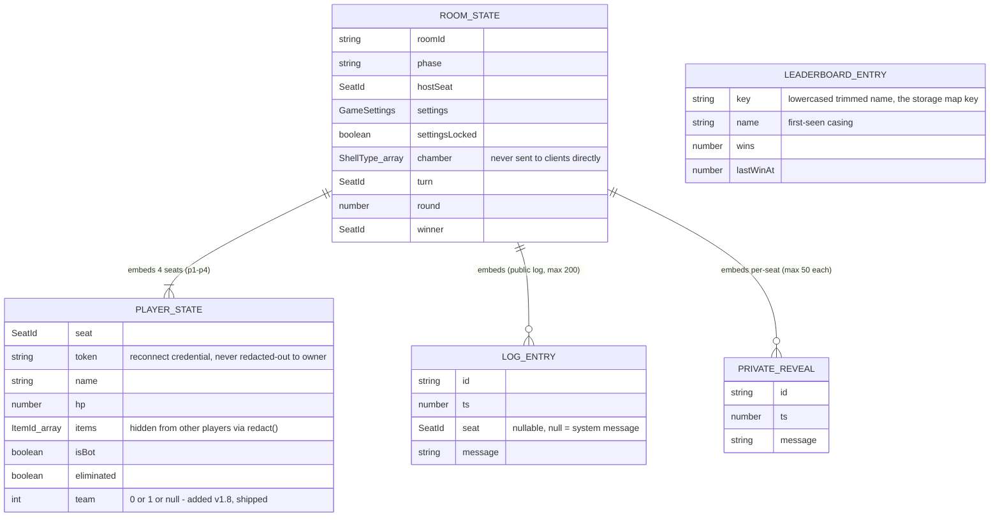

# DATABASE.md — Storage Model

**There is no relational or document database in this project.** All
persistence is either (a) Cloudflare Durable Object storage (server-side,
authoritative) or (b) browser `localStorage` (client-side, non-
authoritative, per-device). This file documents both, since together they
are this project's entire "data layer."

## Provider

Cloudflare Durable Objects, SQLite-backed storage
(`this.ctx.storage.get`/`.put`), accessed via a simple key-value API — no
SQL is written anywhere in this codebase. Two Durable Object *classes*
are bound in `wrangler.jsonc`:

```jsonc
"durable_objects": {
  "bindings": [
    { "name": "Main", "class_name": "Main" },
    { "name": "LEADERBOARD", "class_name": "Leaderboard" }
  ]
},
"migrations": [
  { "tag": "v1", "new_sqlite_classes": ["Main"] },
  { "tag": "v2", "new_sqlite_classes": ["Leaderboard"] }
]
```

## Schema source

There is no schema file — the "schema" is simply the TypeScript shape of
whatever object gets `JSON`-serialized into a storage key, defined in
`src/lib/game/types.ts` (for `Main`) and inline in `party/leaderboard.ts`
(for `Leaderboard`). Cloudflare's Durable Object storage has no enforced
schema; whatever shape you `put()` is exactly what you'll `get()` back
(no ORM, no validation layer beyond TypeScript's compile-time types,
which do not protect against a stored value from an older code version
not matching a newer type — see "Known inconsistencies" below).

## "Tables" (Durable Object instances / storage keys)

### `Main` Durable Object — one instance per room

- **Instance identity:** keyed by room code, lowercased
  (`this.name` inside the DO = the room ID passed via
  `routePartykitRequest`'s room-name resolution — ultimately the
  lowercased 5-character room code from `generateRoomCode()`).
- **Storage key:** `"room"` (constant `STORAGE_KEY` in `party/game.ts`).
- **Value shape:** the full `RoomState` interface (`src/lib/game/types.ts`):

  | Field | Type | Notes |
  |---|---|---|
  | `roomId` | `string` | |
  | `phase` | `"lobby" \| "playing" \| "match_end"` | |
  | `hostSeat` | `SeatId` | always `"p1"` in practice (first seat claimed) |
  | `settings` | `GameSettings` | see below |
  | `settingsLocked` | `boolean` | true after the host's first settings-bearing `join` |
  | `players` | `Record<SeatId, PlayerState>` | always all 4 seat keys present, even if `playerCount < 4` (unused seats just stay disconnected/empty) |
  | `chamber` | `ShellType[]` | **the real, unshuffled-to-client shell order — never sent to any client directly** |
  | `chamberLiveTotal` / `chamberBlankTotal` | `number` | totals for the current load |
  | `turn` | `SeatId` | whose turn it is |
  | `round` | `number` | |
  | `roundWins` | `Record<SeatId, number>` | |
  | `log` | `LogEntry[]` | public log, capped at 200 entries (FIFO-trimmed) |
  | `privateLog` | `Record<SeatId, PrivateReveal[]>` | per-seat private log, each capped at 50 entries |
  | `peekedShell` | `Partial<Record<SeatId, ShellType>>` | who currently knows the next shell (Loupe) |
  | `bonusDrawFor` | `SeatId \| null` | Smoke Bomb's pending bonus-draw target |
  | `scapegoatEverDrawn` | `boolean` | match-wide Scapegoat draw cap |
  | `winnerRecorded` | `boolean` | guards double-recording a leaderboard win |
  | `winner` | `SeatId \| null` | |
  | `createdAt` / `updatedAt` | `number` (epoch ms) | |

  `PlayerState` (nested, per seat):

  | Field | Type | Notes |
  |---|---|---|
  | `seat` | `SeatId` | |
  | `connId` | `string \| null` | current live connection ID, if connected |
  | `token` | `string` | `nanoid(24)` reconnect credential — **sensitive-ish** (see `SECURITY.md`), never sent to other players, but is sent back to the owning client via `welcome` |
  | `name` | `string` | player display name, ≤20 chars |
  | `hp` / `maxHp` | `number` | |
  | `items` | `ItemId[]` | **the real hand — hidden from other players via `redact()`** |
  | `skipNextTurn`, `doubleDamageNext`, `tripleDamageNext`, `forceLiveNext`, `shieldedNext`, `molotovNext` | `boolean` | one-shot status effects from items |
  | `redirectTo` | `SeatId \| null` | Scapegoat's pending redirect |
  | `connected` | `boolean` | |
  | `disconnectedAt` | `number \| null` | epoch ms, used for the reconnect-grace alarm |
  | `isBot` | `boolean` | |
  | `eliminated` | `boolean` | |
  | `team` | `0 \| 1 \| null` | added for v1.8 team modes (shipped 2026-08-06) |

- **Relationships:** All "relational" structure is nested/embedded — a
  room embeds all 4 possible players directly; there is no foreign-key-
  style reference to a separate players table.
- **Indexes:** None — there is nothing to index; each DO instance reads
  its one storage key in full on every access (`getState()`).
- **Row-level security:** None in the database-security sense (there's
  no SQL/rows) — access control is entirely at the application layer
  (`Main.onMessage`'s `seatFor()` lookup + reconnect token check). See
  `SECURITY.md`.
- **Ownership model:** A room's state is "owned" by whichever Durable
  Object instance corresponds to its room code — Cloudflare routes all
  requests for that room code to the same instance, so there's no
  cross-instance consistency concern to manage.
- **Deletion / retention:** **No explicit deletion or TTL exists
  anywhere in this codebase.** A room's Durable Object storage persists
  indefinitely once created — there is no cleanup job, no expiry, no
  manual "delete room" action. Over time, abandoned/finished rooms
  accumulate as inactive Durable Object instances. This is a real,
  unaddressed retention gap — see "Known risks" below.

### `Leaderboard` Durable Object — one single global instance

- **Instance identity:** `env.LEADERBOARD.idFromName("global")` — always
  the same instance, referenced from `Main.saveState()` on `match_end`
  and from the `GET /leaderboard` HTTP route.
- **Storage key:** `"entries"` (constant `STORAGE_KEY` in
  `party/leaderboard.ts`).
- **Value shape:** `Record<string, LeaderboardEntry>`, keyed by
  `name.trim().toLowerCase()`:

  | Field | Type | Notes |
  |---|---|---|
  | `name` | `string` | the *first* casing seen for this key (not re-updated on subsequent wins) |
  | `wins` | `number` | incremented per recorded win |
  | `lastWinAt` | `number` (epoch ms) | used as the tiebreaker sort key |

- **Constraints (application-level, not DB-level):** name trimmed and
  capped to 20 chars (`MAX_NAME_LENGTH`); total tracked names capped at
  500 (`MAX_TRACKED_NAMES`) — when exceeded, the single lowest-`wins`
  entry is evicted (`recordWin()`'s eviction logic; ties broken
  arbitrarily by `Array.reduce` iteration order).
- **Deletion/retention:** No explicit deletion; entries only disappear
  via the 500-entry eviction above. No TTL.

## Generated types

None — no ORM/codegen tool is used. All types are hand-written in
`src/lib/game/types.ts` and `party/leaderboard.ts`.

## Sensitive data

- **Player reconnect tokens** (`PlayerState.token`) — random, per-seat,
  never shown in the UI, but stored in plaintext in both Durable Object
  storage and the owning client's `localStorage`. Not treated as a
  high-value secret (it only grants "act as this seat in this specific,
  ephemeral room," nothing account-wide), but should not be logged or
  exposed to other players. `redact()` correctly never includes it in
  any `RedactedPlayer`.
- **Display names** — free text, no PII validation/scrubbing, capped at
  20 characters, shown publicly in-room and on the leaderboard. Treat as
  low-sensitivity but user-supplied/unvalidated content (see `SECURITY.md`
  re: no output encoding review specifically for this string in every
  render path).
- **No other sensitive data** (no emails, no payment info, no passwords)
  exists anywhere in the storage model.

## Migration risks

- The two existing `wrangler.jsonc` migration tags (`v1` for `Main`,
  `v2` for `Leaderboard`) are **additive, already-applied, SQLite-class
  registrations** — not schema migrations in the traditional sense
  (there's no column/table structure to migrate). **Never edit or remove
  an existing migration tag** — Cloudflare tracks which migrations have
  already run per-environment, and altering history can desync that
  tracking. Only ever *append* a new tag if a genuinely new Durable
  Object class is introduced.
- Because there is no schema enforcement, a **code-level shape change**
  to `RoomState`/`PlayerState` (e.g. this session's in-progress addition
  of `team: 0 | 1 | null`) is not itself a "migration" in the
  Cloudflare sense — but it does mean **any room created under the old
  code and still stored** will be missing the new field(s) when read
  back under new code. This codebase has **no defensive handling** for
  that case (no `?? defaultValue` fallback observed when reading
  `PlayerState` fields back out of storage) — in practice this is a low
  real-world risk only because rooms are short-lived and this project
  has no active migration-sensitive user base, but it is a genuine,
  unaddressed inconsistency risk if ever revisited at scale.

## Known inconsistencies / risks

1. **No room cleanup/TTL** — storage grows unboundedly over the app's
   lifetime (see "Deletion / retention" above). Not urgent at hobby
   scale, but worth knowing before this project sees sustained real
   traffic.
2. **No schema versioning for `RoomState`** — see "Migration risks"
   above. A field added/removed/retyped between deploys has no
   read-time migration/fallback logic.
3. **Leaderboard has no per-name ownership** — see `SECURITY.md` and
   `DECISIONS.md` `DEC-011`. This is a trust/integrity risk, not a data-
   loss risk.

## Entity relationship diagram



`LEADERBOARD_ENTRY` is intentionally disconnected in the diagram above —
it lives in a completely separate Durable Object (`Leaderboard`, single
global instance) with no reference back to any `ROOM_STATE`; the only
link between them is behavioral (`Main.saveState()` calls
`Leaderboard.recordWin(name)` on a human win), not a stored relationship.
